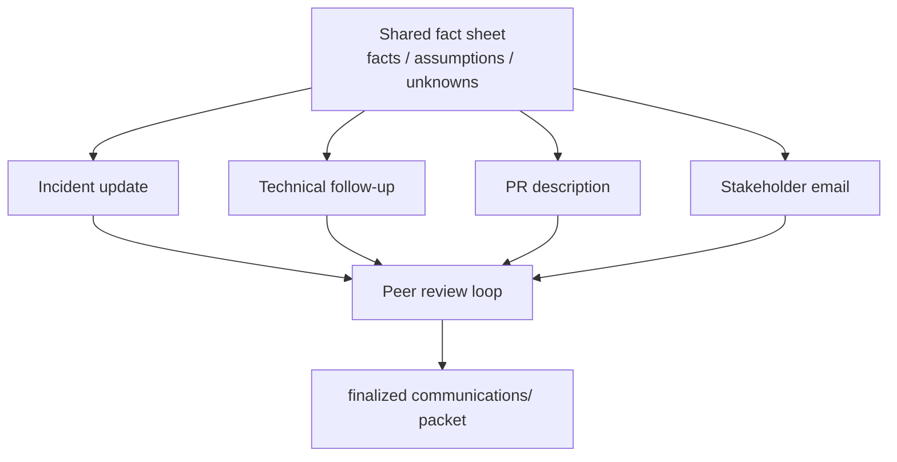

# Lab 47: Professional Communication for a CRM Release — Northstar Stakeholder Pack

**Module:** 47 — Professional Communication for a CRM Release  
**Duration:** ~45 minutes (timed path with starter) · Full path: 3–4 Hours

**Primary IDE:** IntelliJ IDEA Community Edition · **Optional IDE:** VS Code

| OS | How-to for this lab |
| -- | ------------------- |
| Windows | [LAB-47-WINDOWS.md](LAB-47-WINDOWS.md) |
| macOS | [LAB-47-MACOS.md](LAB-47-MACOS.md) |

---

## Activity card

| | |
| --- | --- |
| **Time** | ~45 min timed · full path 3–4 h |
| **Checkpoint** | **E** (after Ex 2→4→3→5→2→6) |
| **Must prove** | Shared facts · four artifacts · consistent severity/next update · secrecy scrub · ≥2 peer rewrites |
| **Hard gate** | Pre-lab Pass · one fact base before drafting |

### What you will learn

Communicate one CRM release/incident consistently to responders, reviewers, and stakeholders.

### Enterprise context

Clarity under time pressure is a deliverable equal to code—contradictory facts fail.

### Predict

Incident SEV-2 vs email SEV-1 — what do you fix first?

### Debug

Peer review file says only "LGTM" — pass criteria?

---

## 45-minute timed path (use starter)

> **Pacing reminder:** [PACING.md](../PACING.md) checkpoint **E**. Homework: full packet polish + briefing notes. Optional Week 5 review 234–244.

In class, use the starter templates so the **core** objectives fit **~45 minutes**. The full Steps below remain for homework / extended depth.

1. Open [`starter/README.md`](starter/README.md).
2. Copy `starter/` into your `java-bootcamp/examples/…` target (see starter README).
3. Fill every `// TODO` / `TODO` — do **not** wait on a perfect prior lab; the starter includes a baseline.
4. Run the starter smoke test. Commit your work to your GitHub repo (no screenshots).
5. Check timed-path Pass criteria in the starter README yourself (do not write the marks down). Continue remaining GUIDE steps as homework if needed.

| Path | Time | Scope |
| ---- | ---- | ----- |
| **Timed (default)** | ~45 min | Starter TODOs + smoke test |
| **Full (extended)** | see Duration | Every Step in this GUIDE |

---

## What you'll complete (practice only)

Labs and exercises are **practice only**. Nothing is submitted or graded. Do not take screenshots. Check Pass/Fail yourself — do not write those marks anywhere. Commit your work to your private `java-bootcamp` GitHub repo.

Keep this checklist visible while you work.

| # | Deliverable |
| - | ----------- |
| 1 | `communications/shared-facts.md` |
| 2 | `communications/incident-update.md` |
| 3 | `communications/pull-request-description.md` |
| 4 | `communications/stakeholder-release-email.md` |
| 5 | `communications/peer-review.md` |
| 5 | Release briefing notes + shared facts |
| 6 | Consistent, secret-free packet |
| 7 | Optional: links to Labs 43–46 evidence |

**Commit to your GitHub repo:** the items in the table above (sources + evidence + short notes).

**Do not commit:** `target/`, `node_modules/`, secrets, heap dumps, or a copied answer keys.

## Lab Overview

This Module 47 lab teaches you to communicate a CRM release clearly to engineers, responders, reviewers, and business stakeholders through an **incident update**, **pull-request description**, **stakeholder email**, and **peer review**. You will produce files under `communications/` plus release briefing notes that share one consistent fact base.

## Learning Objectives

After completing this lab, you will be able to:

* Adapt tone and detail to audience without changing facts
* Write factual, blameless incident updates with next-update times
* Create reviewable PR descriptions with verification and rollback
* Translate technical risk into business impact in plain language
* Separate confirmed facts, assumptions, and unknowns

## Business Scenario

During the CRM 1.4 release, some agents receive errors opening customer profiles. Engineering, reviewers, support, and business leaders need different levels of detail but one consistent fact base.

Use this **lab scenario** (adapt only with instructor approval—do not invent contradictory severity):

| Field | Lab value |
| ----- | --------- |
| Severity | SEV-2 (example) |
| Symptom | Some agents see HTTP 503 opening profiles |
| Started | Document a UTC start (e.g. 13:52 UTC) |
| Suspected change | `crm-api` 1.4.0 rollout (Lab 44 artifact) |
| Mitigation example | Roll back toward 1.3.2 digest; watch readiness + Kafka lag (Lab 46) |
| Fixtures | `CUS-1001` Amina Khan; `CUS-1002` Ravi Singh; `lab-request-001` |

| ID | Name | Notes |
| -- | ---- | ----- |
| `CUS-1001` | Amina Khan | Example profile open failing for some agents |
| `CUS-1002` | Ravi Singh | Example status/projection stale if events lag |
| `lab-request-001` | — | Correlation cited in technical follow-up only |

**Security note for evidence.** No tokens, connection strings, or personal agent emails. Prefer role titles (“Release commander — Team A”). Use fictional support routes.

---

## Architecture Context
### NOW (this lab)



## Prerequisites

Confirm (Lab 0 tools assumed):

* Prior CRM lab notes and release context (or use the lab scenario table)
* Markdown editing in VS Code
* Optional: prior CRM tree available for context (this lab is markdown-only)
* No secrets (keys, tokens, passwords) committed to Git

### Pre-flight

```bash
java -version
mvn -version
```

## Worked example (read before you code)

Study this pattern once before Step 1. Your job is to apply the same idea in the Steps — do not skip ahead to a full solution.

| Field | Lab value |
| ----- | --------- |
| Severity | SEV-2 (example) |
| Symptom | Some agents see HTTP 503 opening profiles |
| Started | Document a UTC start (e.g. 13:52 UTC) |
| Suspected change | `crm-api` 1.4.0 rollout (Lab 44 artifact) |
| Mitigation example | Roll back toward 1.3.2 digest; watch readiness + Kafka lag (Lab 46) |
| Fixtures | `CUS-1001` Amina Khan; `CUS-1002` Ravi Singh; `lab-request-001` |

**What to notice:** Use these fixtures consistently in Main, tests, and screenshots.

---

## Implementation Steps

Complete each step in order. Paths assume `~/java-bootcamp/examples/lab47-crm`. Parts 1–8 map to Steps 1–8.

---

### Step 1 — Collect shared facts (Part 1)

**Why:** Beautiful prose cannot fix contradictory severity across channels.

**Do this:** Fill the starter stub `communications/shared-facts.md`. Review scope, evidence, defects, deployment state, owners, and dates from Labs 43–46 (or the lab scenario). Label **confirmed facts**, **assumptions**, and **unknowns**. Do not invent status or root cause.

Minimum fields:

```markdown
## Confirmed

- ...
## Assumptions

- ...
## Unknowns

- ...
## Owners / next update time

- ...
```

**Expected result:** One fact sheet all other docs will cite.

**If it fails:** Root cause stated as fact without evidence → move to Unknowns/Assumptions.

---

### Step 2 — Define audience and purpose (Part 2)

**Why:** The wrong channel and urgency create either panic or silence.

**Do this:** In your notes (or optionally `docs/release-briefing-notes.md` — not a starter submit file), for each audience (on-call engineers, PR reviewers, business stakeholders, peer reviewer), state what they know, what they must decide, channel, urgency, and the clear ask / next update time.

**Expected result:** Audience matrix with purpose and ask.

**If it fails:** Same walls of text for all audiences → split intents before drafting.

---

### Step 3 — Write incident update (Part 3)

**Why:** Responders need scannable severity, impact, and next touch time.

**Do this:** Fill the starter stub `communications/incident-update.md`. State severity, impact, start time, symptoms, mitigation, owner, and next update. Avoid blame and unsupported cause claims. Use UTC. Quantify impact only where evidence exists.

```markdown
# CRM Incident Update — SEV-2
**Time:** 2026-07-13 14:30 UTC  
**Status:** Mitigating  
**Impact:** Some agents receive HTTP 503 when opening customer profiles. Writes remain available.  
**Started:** 13:52 UTC  
**Current action:** The team rolled back crm-api from 1.4.0 to 1.3.2 and is monitoring readiness and Kafka lag.  
**Known:** Error rate increased after rollout; database health remains green.  
**Unknown:** Root cause remains under investigation.  
**Owner:** Release commander — Team A  
**Next update:** 15:00 UTC or sooner if impact changes.
```

Adapt to your fact sheet. Fixtures may appear sparingly (“synthetic checks on CUS-1001”).

**Expected result:** One-page update matching shared facts; next update time present.

**If it fails:** Blames a named engineer → rewrite blamelessly.

---

### Step 4 — Write technical follow-up (Part 4)

**Why:** Engineers need timeline and signals without changing the public facts.

**Do this (optional / full-path):** If you need a deeper engineering timeline beyond the incident update, add `communications/technical-follow-up.md` (not in the five-file starter submit list). Add timeline, signals (CI digest from Lab 43/44, lag from Lab 46), hypotheses, actions, and results. Distinguish correlation from causation. Link dashboards/runbooks without exposing secrets. Cite `lab-request-001` only in diagnostic context.

**Expected result:** Technical doc aligned with incident update; no secret URLs with tokens.

**If it fails:** Contradicts severity/status of Step 3 → reconcile via fact sheet first.

---

### Step 5 — Draft PR description (Part 5)

**Why:** Reviewers cannot review “fix” with no risk or test story.

**Do this:** Fill the starter stub `communications/pull-request-description.md` for a plausible mitigation/fix PR (rollback automation, DLT handling, health check, etc.—pick one consistent with your facts).

```markdown
## Why

State the customer or operational problem.

## What changed

- Backend:
- Messaging/data:
- Deployment/configuration:

## Verification

_Check **Pass** or **Fail** yourself. Do not write these marks anywhere — nothing is submitted or graded. Commit your work to your GitHub repo._

| # | Confirm | Self-check |
| - | ------- | ---------- |
| 1 | Unit and integration tests | Pass / Fail |
| 2 | Security checks | Pass / Fail |
| 3 | Happy and failure paths (CUS-1001 / CUS-1002) | Pass / Fail |

## Risk and rollback

State compatibility, observability, and exact rollback action.

## Reviewer focus

Ask two or three precise questions.
```

**Expected result:** Complete PR body with verification + rollback + focused questions.

**If it fails:** No rollback → add concrete digest/command references (from Lab 44 style).

---

### Step 6 — Draft stakeholder email (Part 6)

**Why:** Business readers will not parse Kafka consumer groups; they will parse impact and action.

**Do this:** Fill the starter stub `communications/stakeholder-release-email.md` in plain language. Lead with outcome and user impact. Explain schedule, disruption, risk, and support route. Avoid implementation detail that does not support a decision.

```text
Subject: CRM 1.4 release planned for Tuesday, 18:00 UTC

CRM 1.4 improves customer search reliability and case-status updates. We expect no planned outage; users may see brief retries during the rolling deployment.

Engineering completed automated tests, security checks, and staging verification. The team will monitor errors, response time, and support volume for 60 minutes. If thresholds are exceeded, version 1.3.2 will be restored.

No action is required. Report unexpected behavior through the service desk under “CRM Release.”

Regards,
CRM Release Team
```

If you are mid-incident instead of pre-release, rewrite subject/body to match **shared facts** (impact, mitigation, next update)—still without jargon dumps.

**Expected result:** Email a non-engineer can forward; consistent with fact sheet.

**If it fails:** Claims “no risk” while SEV-2 is open → align honesty with facts.

---

### Step 7 — Run peer review (Part 7)

**Why:** Solo authors miss tone/fact drift; peer review is the QA gate for words.

**Do this:** Exchange packets with a peer (or self-review with a written checklist if solo). Fill the starter stub `communications/peer-review.md`. Check fact, audience, action, tone, and consistency. Suggest concrete rewrites (before/after sentences). Author accepts or declines with rationale.

**Expected result:** Peer-review file with ≥2 concrete rewrite suggestions and dispositions.

**If it fails:** “Looks good” only → insufficient; demand specific line-level feedback.

---

### Step 8 — Finalize packet (Part 8)

**Why:** Drafts with wrong dates and secret paste leftovers must not ship.

**Do this:** Correct dates, names, links, and status across all files. Remove secrets and personal data. Archive approved versions and owners in `docs/release-briefing-notes.md`. Optionally:

```bash
cd ~/java-bootcamp/examples/lab43-crm 2>/dev/null || true
./mvnw -q -B test 2>/dev/null || true
cd ~/java-bootcamp/examples/lab47-crm
git status --short
```

**Expected result:** Consistent finalized packet; scrub complete; owners listed.

**If it fails:** Residual token in a pasted log → delete, rotate if real, replace with redacted excerpt.

---

### Step 9 — Failure experiments + evidence pack

**Why:** Communication failure modes are as real as pipeline failure modes.

**Do this:** Complete Failure Experiments. Keep the packet internally consistent after each experiment’s restore. Add a final consistency scan note to `docs/release-briefing-notes.md`:

```markdown
## Final consistency scan

_Check **Pass** or **Fail** yourself. Do not write these marks anywhere — nothing is submitted or graded. Commit your work to your GitHub repo._

| # | Confirm | Self-check |
| - | ------- | ---------- |
| 1 | Same severity/status across incident + stakeholder drafts | Pass / Fail |
| 2 | Same mitigation named (e.g. rollback to 1.3.2) | Pass / Fail |
| 3 | Assumptions not presented as facts | Pass / Fail |
| 4 | No secrets (`rg` check clean) | Pass / Fail |
| 5 | Peer rewrites applied or declined with rationale | Pass / Fail |
```

**Expected result:** ≥3 experiments documented; final packet ready for rubric.

**If it fails:** See Troubleshooting.

---

## Implementation Checkpoints

### Checkpoint A — Tooling

_Check **Pass** or **Fail** yourself. Do not write these marks anywhere — nothing is submitted or graded. Commit your work to your GitHub repo._

| # | Confirm | Self-check |
| - | ------- | ---------- |
| 1 | `lab47-crm` with `communications/` tree | Pass / Fail |
| 2 | Shared fact sheet created | Pass / Fail |
| 3 | Prior lab evidence linked or scenario labeled | Pass / Fail |

### Checkpoint B — Core artifacts

_Check **Pass** or **Fail** yourself. Do not write these marks anywhere — nothing is submitted or graded. Commit your work to your GitHub repo._

| # | Confirm | Self-check |
| - | ------- | ---------- |
| 1 | Incident update with next update time | Pass / Fail |
| 2 | Technical follow-up aligned to facts | Pass / Fail |
| 3 | PR description with verification + rollback | Pass / Fail |

### Checkpoint C — Audience + review

_Check **Pass** or **Fail** yourself. Do not write these marks anywhere — nothing is submitted or graded. Commit your work to your GitHub repo._

| # | Confirm | Self-check |
| - | ------- | ---------- |
| 1 | Stakeholder email in plain language | Pass / Fail |
| 2 | Peer review with concrete rewrites | Pass / Fail |
| 3 | Audience matrix documented | Pass / Fail |

### Checkpoint D — Hygiene

_Check **Pass** or **Fail** yourself. Do not write these marks anywhere — nothing is submitted or graded. Commit your work to your GitHub repo._

| # | Confirm | Self-check |
| - | ------- | ---------- |
| 1 | Facts / assumptions / unknowns labeled | Pass / Fail |
| 2 | No secrets or real PII | Pass / Fail |
| 3 | Dates/status consistent across all docs | Pass / Fail |

---

## Reference Commands, Configuration, and Code

### Shared facts skeleton

```markdown
# Shared facts — CRM 1.4 lab scenario


## Confirmed

- Symptom:
- Start (UTC):
- Mitigation in progress:
## Assumptions

-
## Unknowns

- Root cause:
## Owners

- Release commander:
## Next update

- Time (UTC):
## Fixtures (synthetic only)

- CUS-1001 Amina Khan; CUS-1002 Ravi Singh; lab-request-001
## Links to prior labs (paths only)

- Lab 43 ci-runbook:
- Lab 44 rollback-runbook:
- Lab 46 dlt-replay-runbook:
```

### Incident update skeleton

```markdown
# CRM Incident Update — SEV-2
**Time:** 2026-07-13 14:30 UTC  
**Status:** Mitigating  
**Impact:** Some agents receive HTTP 503 when opening customer profiles. Writes remain available.  
**Started:** 13:52 UTC  
**Current action:** The team rolled back crm-api from 1.4.0 to 1.3.2 and is monitoring readiness and Kafka lag.  
**Known:** Error rate increased after rollout; database health remains green.  
**Unknown:** Root cause remains under investigation.  
**Owner:** Release commander — Team A  
**Next update:** 15:00 UTC or sooner if impact changes.
```

### PR template

```markdown
## Why

State the customer or operational problem.

## What changed

- Backend:
- Messaging/data:
- Deployment/configuration:

## Verification

_Check **Pass** or **Fail** yourself. Do not write these marks anywhere — nothing is submitted or graded. Commit your work to your GitHub repo._

| # | Confirm | Self-check |
| - | ------- | ---------- |
| 1 | Unit and integration tests | Pass / Fail |
| 2 | Security checks | Pass / Fail |
| 3 | Happy and failure paths (CUS-1001 / CUS-1002 / lab-request-001) | Pass / Fail |

## Risk and rollback

State compatibility, observability, and exact rollback digest/action.

## Reviewer focus

1.
2.
3.
```

### Stakeholder email

```text
Subject: CRM 1.4 release planned for Tuesday, 18:00 UTC

CRM 1.4 improves customer search reliability and case-status updates. We expect no planned outage; users may see brief retries during the rolling deployment.

Engineering completed automated tests, security checks, and staging verification. The team will monitor errors, response time, and support volume for 60 minutes. If thresholds are exceeded, version 1.3.2 will be restored.

No action is required. Report unexpected behavior through the service desk under “CRM Release.”

Regards,
CRM Release Team
```

### Peer-review template

```markdown
# Peer review — Lab 47
Reviewer / date:
## Consistency with shared-facts.md

-
## Audience fit

-
## Concrete rewrites

1. Before: ...
   After: ...
2. Before: ...
   After: ...
## Author disposition

- Accept / decline + rationale
```

### Commands

```bash
cd ~/java-bootcamp/examples/lab47-crm
ls communications
wc -l communications/*.md docs/*.md
# Optional cross-check: ensure no obvious secrets
rg -n "password|token|AKIA|BEGIN RSA|kubeconfig" communications docs || true
git status --short
```

### Evidence log template

```markdown
# Lab 47 Evidence Log
- Scenario used (lab table / real prior evidence):
- Peer reviewer:
## Results

| Check | Result | Evidence |
| ----- | ------ | -------- |
| Shared facts labeled | PASS/FAIL | |
| Incident update complete | PASS/FAIL | |
| PR description complete | PASS/FAIL | |
| Stakeholder email complete | PASS/FAIL | |
| Peer rewrites ≥2 | PASS/FAIL | |
| Secret scrub | PASS/FAIL | |
```

### Artifact map

| Artifact | Audience |
| -------- | -------- |
| `shared-facts.md` | All writers (source of truth) |
| `incident-update.md` | Responders / war room |
| `technical-follow-up.md` | Engineers |
| `pull-request-description.md` | Reviewers |
| `stakeholder-release-email.md` | Business / support |
| `peer-review.md` | Author quality gate |
| `release-briefing-notes.md` | Owners + archive |

---

## Failure Experiments

| # | Experiment | Observe | Restore |
| - | ---------- | ------- | ------- |
| 1 | Draft update claiming root cause without evidence | Peer should reject | Move to Unknowns |
| 2 | Stakeholder email contradicting SEV status | Inconsistency caught | Align to fact sheet |
| 3 | Paste a fake secret into a draft | Scrub risk visible | Remove; add scrub checklist |
| 4 | Vague peer comment “unclear” | Not actionable | Rewrite as before/after |
| 5 | Miss next-update time | Ops ambiguity | Restore required field |

---

## Troubleshooting

| Symptom | Likely cause | Fix |
| ------- | ------------ | --- |
| Docs disagree on severity | No shared fact sheet | Rebuild Step 1; re-sync |
| Stakeholder panic | Too much uncertainty framed badly | Lead with impact + actions |
| Engineer says “useless” | Missing signals/links | Add technical follow-up detail |
| Reviewer cannot test | PR lacks verification steps | Add commands/fixtures |
| Accidental blame tone | Stress drafting | Blameless rewrite pass |
| Secret in markdown | Log paste | Delete; rotate if real |
| Empty peer review | Skipped critique | Require two rewrites |
| Conflicting next-update times | Copy/paste drift | Single source in shared-facts.md |

## Security and Production Review

Optional — jot brief notes in your README if useful for your progress check (not a separate essay):

1. Which inputs are untrusted (chat rumors vs telemetry)?
2. Where are approval gates for external stakeholder email?
3. Which values are sensitive in incident pastes?

---


## Cleanup

```bash
cd ~/java-bootcamp/examples/lab47-crm
git status --short
```

Remove any accidental secret pastes. Keep the finalized packet for portfolio. No cluster teardown required (docs lab).

**Keep `lab47-crm`**—Capstone presentations often reuse these templates.


## Reflection Questions

Write **1–3 sentence** answers (not essays):

1. Which design decision most affected clarity (fact sheet vs tone)?
2. What evidence proves the packet is internally consistent?
3. Which failure was hardest to diagnose (contradiction type)?

---


