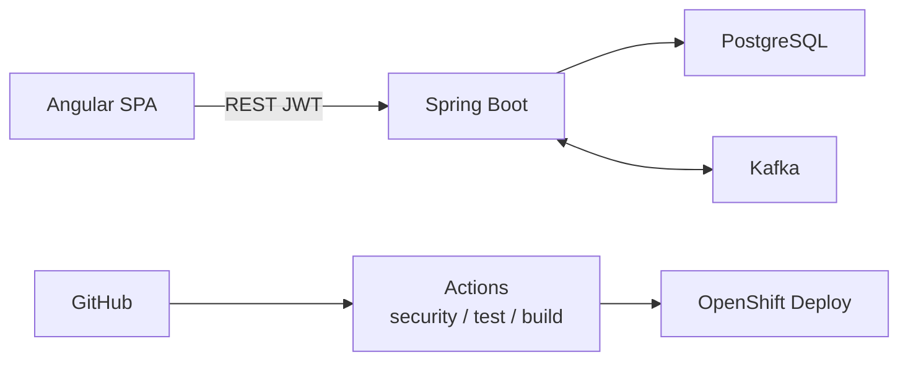

# Lab 48: Capstone Architecture and Planning — Northstar CRM Delivery Blueprint

**Module:** 48 — Capstone Architecture and Planning  
**Duration:** ~45 minutes (timed path / session block with starter) · Full path: 4–6 Hours

**Primary IDE:** IntelliJ IDEA Community Edition · **Optional IDE:** VS Code / draw.io / Mermaid

| OS | How-to for this lab |
| -- | ------------------- |
| Windows | [LAB-48-WINDOWS.md](LAB-48-WINDOWS.md) |
| macOS | [LAB-48-MACOS.md](LAB-48-MACOS.md) |

---

## Activity card

| | |
| --- | --- |
| **Time** | ~45 min session block · full path 4–6 h |
| **Checkpoint** | **E** (session-block planning — no separate pre-lab exercises) |
| **Must prove** | Stack diagram · AI plan · Actions plan · TF/Ansible plan · env strategy · backlog seeds |
| **Hard gate** | Pre-lab Pass · Week 1–5 concepts available · no code-first sprawl |

### What you will learn

Freeze an defendable fullstack architecture and delivery plan before Labs 49–52 implementation.

### Enterprise context

Coding without an architecture and gate plan produces demos that cannot survive security or Ops review.

### Predict

Where does JWT validation belong—Angular only, API only, or both with clear ownership?

### Debug

Diagram shows Oracle or Bitbucket — what must you correct for this bootcamp?

---

## 45-minute timed path (session block — use starter)

> **Pacing reminder:** [PACING.md](../PACING.md) checkpoint **E**. Homework: ADRs, full backlog, peer review of diagrams.

1. Open [`starter/README.md`](starter/README.md).
2. Copy `starter/` into `java-bootcamp/examples/lab48-capstone-plan`.
3. Fill every `TODO` in docs templates (architecture, AI, CI/CD, IaC, environments).
4. Produce at least one Mermaid (or exported) diagram. Commit your work to your GitHub repo (no screenshots).
5. Mark timed-path Pass criteria. Continue remaining GUIDE steps as homework.

| Path | Time | Scope |
| ---- | ---- | ----- |
| **Timed / session block** | ~45 min | Starter TODOs + one diagram + backlog seeds |
| **Full (extended)** | 4–6 Hours | Every Step in this GUIDE |

Policy: [`labs/_STARTER-PATH.md`](../../../_STARTER-PATH.md)

---

## What you'll complete (practice only)

Labs and exercises are **practice only**. Nothing is submitted or graded. Do not take screenshots. Check Pass/Fail yourself — do not write those marks anywhere. Commit your work to your private `java-bootcamp` GitHub repo.

| # | Deliverable |
| - | ----------- |
| 1 | `docs/architecture.md` + diagrams (Angular → REST → Spring Boot → PostgreSQL; Kafka; OpenShift) |
| 2 | `docs/ai-usage-plan.md` (allowed uses, verification, forbidden) |
| 3 | `docs/github-actions-plan.md` (PR/main/tag jobs, gates, artifacts) |
| 4 | `docs/terraform-ansible-plan.md` (scope, state, idempotence, secrets) |
| 5 | `docs/environment-strategy.md` (dev/test/stage/prod mapping to OpenShift) |
| 6 | `docs/backlog.md` with CAP-style stories (at least CAP-12 seed for Lab 49) |
| 7 | No secrets, real customer data, or Bitbucket/Oracle/React/SOAP as taught path |

**Commit to your GitHub repo:** the items in the table above (sources + evidence + short notes).

**Do not commit:** `target/`, `node_modules/`, secrets, heap dumps, or a copied answer keys.

## Lab Overview

This Module 48 lab produces the **capstone planning pack** for Northstar CRM: architecture, AI governance, GitHub Actions, Terraform/Ansible, and environment strategy that Labs 49–51 implement against.

## Learning Objectives

After completing this lab, you will be able to:

* Document the mandatory fullstack data and control paths
* Plan GitHub Actions quality gates before writing workflow YAML in Lab 51
* Bound Terraform/Ansible scope and secret handling
* Define environment promotion and OpenShift Project strategy
* Seed an acceptance-backed backlog for implementation labs

## Business Scenario

Leadership freezes: **No Lab 49+ merge without a reviewed architecture and delivery plan.** Your plan must name **Angular**, **REST**, **Spring Boot**, **PostgreSQL**, **Kafka**, **Docker**, **OpenShift**, **GitHub Actions**, and **Terraform/Ansible**—not Bitbucket, Oracle, React, or SOAP.

| ID | Name | Notes |
| -- | ---- | ----- |
| `CUS-1001` | Amina Khan | Primary fixture across capstone |
| `CUS-1002` | Ravi Singh | Secondary fixture |
| `CAP-12` | Interaction slice | Seed story for Lab 49 |
| `lab48-capstone-plan` | — | Planning repo/folder name |

---

## Architecture Context
### NOW (this lab) — mandatory shape



## Prerequisites

* Weeks 1–5 labs conceptually complete (or instructor waiver)
* Markdown + Mermaid (or draw.io export) available
* GitHub account for later Actions labs

### Pre-flight

```bash
mkdir -p ~/java-bootcamp/examples/lab48-capstone-plan/docs
```

## Worked example (read before you plan)

```markdown
## CAP-12 — Record customer interaction
**As** an agent **I want** to POST an interaction for CUS-1001
**So that** the note persists in PostgreSQL and emits CustomerInteractionRecordedV1 on Kafka.
**Acceptance:** 201 + row + event with correlation lab-request-001; 404 for CUS-9999.
```

**What to notice:** Acceptance criteria drive Labs 49–50; CI/CD and OpenShift come later—but must be planned now.

---

## Implementation Steps

Commands assume `~/java-bootcamp/examples/lab48-capstone-plan`.

---

### Step 1 — Freeze technology stack and ADRs

**Why:** Ambiguous stack choices leak Oracle/React/Bitbucket into diagrams and fail review.

**Do this:** In `docs/architecture.md`, list components and non-goals. Write 2–3 short ADRs (e.g. PostgreSQL over alternatives; GitHub Actions over other CI; OpenShift Routes for SPA/API exposure). Explicitly reject Bitbucket Pipelines, Oracle, React, and SOAP as taught paths.

**Expected result:** Stack table + ADRs a peer can audit in five minutes.

**If it fails:** Diagram still says SOAP/React → rewrite before Step 2.

---

### Step 2 — Draw application and messaging architecture

**Why:** Labs 49–50 implement against this picture.

**Do this:** Produce diagrams for: (1) Angular → REST → Spring Boot → PostgreSQL; (2) Spring Boot ↔ Kafka topics; (3) JWT interceptor → API security. Save Mermaid in-repo and commit to GitHub (no screenshots).

**Expected result:** Three coherent views with fixture IDs called out.

**If it fails:** Kafka shown as replacing PostgreSQL → clarify persist-then-publish (or chosen pattern) in text.

---

### Step 3 — AI usage plan

**Why:** Unbounded AI use fails enterprise governance and capstone defense.

**Do this:** Create `docs/ai-usage-plan.md`: allowed tasks (boilerplate, tests drafts, HCL sketches), mandatory human verification, forbidden (secrets, production applies, copying proprietary code). Include at least one “verify AI output” checklist item for Angular and for Flyway/SQL.

**Expected result:** Plan Lab 45/50/51 can cite without rewriting.

**If it fails:** “AI can generate anything” → add hard forbids.

---

### Step 4 — GitHub Actions plan

**Why:** Lab 51 implements gates you invent here.

**Do this:** In `docs/github-actions-plan.md`, specify PR vs `main` vs tag behavior: Angular `npm ci` / `ng test` / `ng build`, Maven verify, SAST/dependency scan, container build/scan, artifact identity, OpenShift deploy job ownership, environments/approvals. Reference Lab 43 patterns; note Angular frontend build is in fullstack scope.

**Expected result:** Job/gate table with owners and evidence artifacts.

**If it fails:** Deploy rebuilds JAR inside OpenShift job → require package-once / digest promote.

---

### Step 5 — Terraform / Ansible and environment strategy

**Why:** IaC without env boundaries creates accidental prod blast radius.

**Do this:** Write `docs/terraform-ansible-plan.md` (providers, remote state, no secrets in Git, Ansible idempotence) and `docs/environment-strategy.md` (dev/test/stage/prod ↔ OpenShift Projects, config promotion, approval gates). Align names with Labs 42/44/45.

**Expected result:** Clear non-prod vs prod rules; state backend described without credentials.

**If it fails:** Single shared Project for all envs → split strategy.

---

### Step 6 — Backlog seeds and peer review

**Why:** Lab 49 needs CAP-12 (or equivalent) acceptance frozen.

**Do this:** Create `docs/backlog.md` with CAP-12 plus 4–6 related stories (Angular list/detail, JWT login shell, Flyway interaction table, Actions PR gate, OpenShift smoke). Peer-review diagrams for stack accuracy. Capture review notes.

**Expected result:** Backlog ready for Lab 49; peer sign-off recorded.

**If it fails:** Stories lack acceptance → rewrite before coding.

---

## Implementation Checkpoints

| # | Confirm | Self-check |
| - | ------- | ---------- |
| 1 | Architecture uses Angular · REST · Spring Boot · PostgreSQL · Kafka · OpenShift · Actions | Pass / Fail |
| 2 | AI usage plan with verification + forbids | Pass / Fail |
| 3 | GitHub Actions plan includes Angular + Java gates | Pass / Fail |
| 4 | Terraform/Ansible + environment strategy present | Pass / Fail |
| 5 | CAP-12 (or agreed) backlog seed ready for Lab 49 | Pass / Fail |

---

## Safety Rules

* Planning docs only—no production applies from this lab.
* Never paste cloud keys, kubeconfig, or JWT secrets into markdown.
* Keep fixtures fictional (`CUS-1001`).

---

## Reference outline (`docs/architecture.md`)

```markdown
# Northstar CRM Capstone Architecture
## Runtime path
Angular SPA → REST (JWT) → Spring Boot → PostgreSQL
Spring Boot ↔ Kafka (versioned events)
## Delivery path
GitHub → Actions (SAST, test, build) → image digest → OpenShift
## Non-goals
Bitbucket Pipelines, Oracle DB, React UI, SOAP services
```

## Failure Experiments

| # | Experiment | Observe | Restore |
| - | ---------- | ------- | ------- |
| 1 | Insert Oracle on diagram | Peer rejects | Correct to PostgreSQL |
| 2 | Omit Angular build from CI plan | Lab 51 gap | Add npm job |
| 3 | AI plan allows secret generation | Security fail | Forbid + rotate guidance |

## Troubleshooting

| Symptom | Likely cause | Fix |
| ------- | ------------ | --- |
| Scope explosion | No non-goals | Tighten ADRs |
| Lab 49 blocked | Missing CAP-12 | Finish backlog |
| Ops rejects plan | No OpenShift envs | Complete env strategy |

## Cleanup

```bash
cd ~/java-bootcamp/examples/lab48-capstone-plan
git status --short
```

**Keep `lab48-capstone-plan`**—Labs 49–52 cite these docs in demos and defense.

## Reflection Questions

1. Which ADR most reduced implementation risk?
2. How does the Actions plan prove package-once promotion?
3. What will you verify when AI drafts Angular or Flyway?
