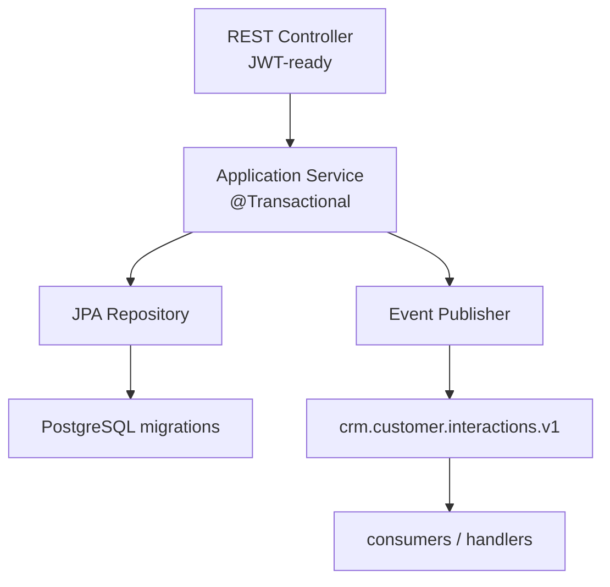

# Lab 49: Capstone Backend and Messaging — Northstar CRM Interaction Slice

**Module:** 49 — Capstone Backend and Messaging  
**Duration:** ~45 minutes (timed path / session block with starter) · Full path: 6–8 Hours

**Primary IDE:** IntelliJ IDEA Community Edition · **Optional IDE:** VS Code

| OS | How-to for this lab |
| -- | ------------------- |
| Windows | [LAB-49-WINDOWS.md](LAB-49-WINDOWS.md) |
| macOS | [LAB-49-MACOS.md](LAB-49-MACOS.md) |

---

## Activity card

| | |
| --- | --- |
| **Time** | ~45 min session block · full path 6–8 h multi-day |
| **Checkpoint** | **E** (after Ex 1→2→3→4→5→6) |
| **Must prove** | Service TODOs · compile · fixture IDs · event V1 sketch |
| **Hard gate** | Pre-lab Pass · Lab 48 story selected · docs before claiming done |

### What you will learn

Implement a CRM interaction vertical slice: validated API, persistence, versioned Kafka event, tests, demo runbook.

### Enterprise context

A green demo without tests, correlation, or failure-path evidence does not pass capstone quality.

### Predict

Should the publisher run before the DB transaction commits?

### Debug

Entity returned as JSON from the controller — what is missing?

---

## 45-minute timed path (session block — use starter)

> **Pacing reminder:** [PACING.md](../PACING.md) checkpoint **E**. Homework/multi-day: Flyway, Kafka IT, consumer/DLT, verify twice, `docs/backend-demo.md`.

In class, use the starter service stub so the **session block** fits **~45 minutes**. Backend + messaging depth (Flyway, Kafka IT, consumer/DLT, full verify) remains **multi-day** on the full path.

1. Open [`starter/README.md`](starter/README.md).
2. Copy `starter/` into `java-bootcamp/examples/lab49-crm/` (see starter README). Capstone teams may merge `backend/` into an existing `customer-management-platform` monorepo instead.
3. Fill every `// TODO` in the interaction service stub — starter includes an in-memory baseline.
4. Run the starter build/smoke. Commit your work to your GitHub repo (no screenshots).
5. Check timed-path Pass criteria in the starter README yourself (do not write the marks down). Continue remaining GUIDE steps as homework / multi-day work.

| Path | Time | Scope |
| ---- | ---- | ----- |
| **Timed / session block** | ~45 min | Starter TODOs + smoke test |
| **Full (multi-day)** | 6–8 Hours | Every Step in this GUIDE |

Policy: [`labs/_STARTER-PATH.md`](../../../_STARTER-PATH.md)

---

## What you'll complete (practice only)

Labs and exercises are **practice only**. Nothing is submitted or graded. Do not take screenshots. Check Pass/Fail yourself — do not write those marks anywhere. Commit your work to your private `java-bootcamp` GitHub repo.

Keep this checklist visible while you work.

| # | Deliverable |
| - | ----------- |
| 1 | Backend source changes for the interaction vertical slice |
| 2 | Database migration for interaction persistence |
| 3 | Versioned event contract (`CustomerInteractionRecordedV1` or equivalent) |
| 4 | Unit and integration tests (HTTP, persistence, messaging) |
| 5 | `docs/backend-demo.md` reproduction runbook |
| 6 | Baseline and final validation results (`mvn clean verify`) |
| 7 | One controlled failure-path result (invalid input or not-found) |
| 8 | Concise setup and reproduction guide cross-links |

**Commit to your GitHub repo:** the items in the table above (sources + evidence + short notes).

**Do not commit:** `target/`, `node_modules/`, secrets, heap dumps, or a copied answer keys.

## Lab Overview

This Module 49 lab implements or extends the CRM **Spring Boot + Kafka vertical slice** for recording customer interactions: validated REST APIs, transaction-safe persistence, versioned events, resilient consumption, and automated tests—producing `docs/backend-demo.md` evidence for the defense.

## Learning Objectives

After completing this lab, you will be able to:

* Implement layered Spring Boot features for a CRM vertical slice
* Keep JPA entities out of external contracts; validate DTOs
* Use transactions deliberately around persist + publish strategy
* Publish versioned Kafka events with correlation and actor metadata
* Consume idempotently with bounded retries and DLT

## Business Scenario

Service agents need to record customer interactions for Amina (`CUS-1001`) and continue Ravi’s (`CUS-1002`) journey. Leadership freezes:

**No merge of the interaction slice without API evidence, persistence proof, versioned event proof, automated tests, and a documented failure path.**

You own that backend gate using Lab 48 CAP-12 acceptance criteria.

Use these fixtures consistently:

| ID | Name | Notes |
| -- | ---- | ----- |
| `CUS-1001` | Amina Khan | `ACTIVE` — primary interaction create target |
| `CUS-1002` | Ravi Singh | secondary customer / list filters |
| `CUS-9999` | — | not-found paths |
| `lab-request-001` | — | `X-Correlation-ID` on HTTP and events |
| `capstone-49-001` | — | optional alternate correlation for smoke curls |

**Security note for evidence.** Use fictional emails and summaries. Never log full interaction notes with secrets; never commit broker credentials.

---

## Architecture Context
### NOW (this lab)



## Prerequisites

Prior labs: [Lab 48](../../module-48/lab48/LAB-48-GUIDE.md).

Confirm (Lab 0 tools assumed):

* Java 21 + Maven + Spring Boot backend present or scaffolded
* shared Kafka (instructor bootstrap; local Compose optional if allowed) (or instructor broker)
* JUnit 5 + Spring test stack
* Lab 48 backlog + ADRs available under `docs/`
* No secrets committed to Git

### Pre-flight

```bash
java -version
mvn -version
```

## Worked example (read before you code)

Study this pattern once before Step 1. Your job is to apply the same idea in the Steps — do not skip ahead to a full solution.

```bash
curl -i -X POST "http://localhost:8080/api/v1/interactions" \
  -H 'Content-Type: application/json' \
  -H "Authorization: Bearer $TOKEN" \
  -H 'X-Correlation-ID: lab-request-001' \
  -d '{"customerId":"CUS-1001","interactionType":"NOTE","summary":"Requested address update","correlationId":"lab-request-001"}'
```

**What to notice:** Match names, IDs, and failure behavior from the scenario — instructors check these.

---

## Implementation Steps

Complete each step in order. Commands assume capstone `backend/` unless noted. Parts 1–8 map to Steps 1–8; Step 9 closes evidence.

---

### Step 1 — Select vertical slice (Part 1)

**Why:** Coding without a frozen acceptance list produces feature sprawl and an undefendable demo.

**Do this:** Open Lab 48 `docs/backlog.md`. Choose CAP-12 (or instructor equivalent). In `docs/backend-demo.md` write:

* Acceptance criteria copied and numbered
* API, persistence, event, security stub, observability change list
* Definition of done + demo evidence checklist before coding
* Fixture plan: seed/find `CUS-1001`, correlation `lab-request-001`

```bash
cd ~/java-bootcamp/examples/lab49-crm
```

**Expected result:** Written DoD; peer can state what “done” means without watching you code.

**If it fails:** Story missing → return to Lab 48 or agree a CAP-12 substitute with instructor. Scope includes UI → defer UI to Lab 50.

---

### Step 2 — Create domain and DTOs (Part 2)

**Why:** Shipping JPA entities as JSON couples Angular clients to persistence and breaks Lab 50 typing.

**Do this:** Create immutable request/response/event records. Keep entities internal. Use Bean Validation for `interactionType` (`CALL`, `EMAIL`, `NOTE`, `MEETING`). Customer id is a **String** fixture (`CUS-1001`), not a UUID path param.

Example shapes (adapt to your IDs):

```java
import jakarta.validation.constraints.NotBlank;
import jakarta.validation.constraints.Size;
import java.time.Instant;

public record CreateInteractionRequest(
    @NotBlank String customerId,
    @NotBlank String interactionType,  // CALL, EMAIL, NOTE, MEETING
    @NotBlank @Size(max = 1000) String summary,
    String correlationId) {}

public record InteractionResponse(
    String id, String customerId, String interactionType, String summary,
    String correlationId, Instant createdAt) {}

public record CustomerInteractionRecordedV1(
    String eventId, String eventType, int eventVersion,
    Instant occurredAt, String correlationId, String actor,
    String customerId, String interactionId, String interactionType) {}
```

**Expected result:** DTOs compile; entities not referenced from controller method signatures.

**If it fails:** Validation missing → add `@Valid` plan for Step 5. Entity in public API → introduce mapper.

---

### Step 3 — Implement persistence (Part 3)

**Why:** Constraints and indexes belong in migrations, not “Hibernate will figure it out.”

**Do this:** Add Flyway/Liquibase migration for `customer_interaction` (PostgreSQL-compatible types if targeting PostgreSQL; H2/Testcontainers profile for CI if instructor allows). Repository methods by business need (`findByCustomerIdOrderByCreatedAtDesc`). Avoid N+1 when loading timelines.

Inspect generated SQL in a test or log once. Seed Amina (`CUS-1001`) and Ravi (`CUS-1002`) via migration or `@Sql` so repository tests are deterministic.

Document in `docs/backend-demo.md`:

* Migration version id
* Primary key strategy (UUID/RAW)
* Index purpose (timeline by customer + time)
* Which profile runs against PostgreSQL vs H2

**Expected result:** Migration applies; repository round-trip saves interaction for seeded Amina; SQL plan/log inspected once.

**If it fails:** Type mismatch PostgreSQL vs H2 → document profile strategy. Missing FK to customer → add constraint aligning with Lab 48 ADR. Flaky seed → use fixed fixture IDs, never random emails.

---

### Step 4 — Build application service (Part 4)

**Why:** Controllers that open transactions and publish ad hoc skip business rules and correlation.

**Do this:** Implement `InteractionService` with `@Transactional` boundary per Lab 48 consistency ADR:

* Load customer or throw not-found for `CUS-9999`
* Map conflict/validation outcomes
* Persist interaction
* Publish event via collaborator (not static Kafka client inside domain)
* Propagate actor + `correlationId` without logging note secrets

```java
import org.springframework.transaction.annotation.Transactional;
import java.util.UUID;

@Transactional
public InteractionResponse create(UUID customerId, CreateInteractionRequest request, String correlationId) {
  var customer = customers.findById(customerId)
      .orElseThrow(() -> new CustomerNotFoundException(customerId));
  var saved = interactions.save(mapper.toEntity(customer, request));
  events.publish(eventFactory.interactionRecorded(saved, correlationId));
  return mapper.toResponse(saved);
}
```

Unit-test the service with a fake publisher that records the event payload for `lab-request-001`. Assert customer not-found never calls publish.

**Expected result:** Service tests cover happy path + not-found without starting full server; publisher invoked only after successful save path.

**If it fails:** Publish before persist without ADR → stop and align with Lab 48. Missing correlation → thread from controller header. Service opens Kafka admin clients → inject port so tests stay fast.

---

### Step 5 — Expose REST endpoint (Part 5)

**Why:** Wrong status codes and opaque 500s block frontend integration and panel trust.

**Do this:** `POST /api/v1/interactions` returning 201 (+ `Location` if you add it). Use Problem Details for validation and not-found. Read `X-Correlation-ID` (default generate if absent—but demos must send `lab-request-001`). Prepare `@PreAuthorize` stubs if security present; Lab 51 hardens fully.

```java
import org.springframework.web.bind.annotation.PostMapping;
import org.springframework.web.bind.annotation.RequestBody;
import org.springframework.web.bind.annotation.RequestHeader;
import org.springframework.web.bind.annotation.RequestMapping;
import org.springframework.web.bind.annotation.RestController;
import jakarta.validation.Valid;
import org.springframework.http.ResponseEntity;

@RestController
@RequestMapping("/api/v1/interactions")
class InteractionController {
  @PostMapping
  ResponseEntity<InteractionResponse> create(
      @RequestBody @Valid CreateInteractionRequest request,
      @RequestHeader(value = "X-Correlation-ID", required = false) String correlationHeader) {
    var result = service.create(request, correlationHeader);
    return ResponseEntity.status(201).body(result);
  }
}
```

Also add GET timeline endpoint if CAP story requires it for Lab 50. Capture MockMvc JSON snippets (sanitized) under `~/java-bootcamp/notes/lab-49/`.

**Expected result:** Service/MockMvc: 201 for `CUS-1001`; validation error for invalid `interactionType`; `UnknownCustomerException` for `CUS-9999`.

**If it fails:** 200 on create → fix to 201. Stack traces in body → Problem Details advice. Path variable type mismatch vs Lab 50 client → freeze ID type in contract doc.

---

### Step 6 — Publish Kafka event (Part 6)

**Why:** Unversioned fire-and-forget events become silent data loss under consumer lag.

**Do this:** Use stable topic (e.g. `crm.customer.interactions.v1`) and partition key = customer id. Include event ID, type, version, time, actor, correlation ID. Publish only with documented consistency strategy (after commit / outbox).

Verify with console consumer in demo.md.

**Expected result:** One event for one successful create; payload includes `lab-request-001` and Amina’s customer id.

**If it fails:** Event on validation failure → do not publish. Wrong key → fix partition key to customer.

---

### Step 7 — Implement resilient consumer (Part 7)

**Why:** At-least-once delivery without dedupe double-sends notifications and fails the defense.

**Do this:** Consumer validates `eventVersion`, deduplicates on `eventId`, uses bounded retries, routes poison messages to DLT, and logs correlation without note body. Make lag/failure observable (counter or structured log).

**Expected result:** Duplicate delivery is no-op; poison message lands in DLT (or documented training substitute).

**If it fails:** Infinite retry storm → add backoff + DLT. Ignoring version → reject incompatible events.

---

### Step 8 — Test complete slice (Part 8)

**Why:** Untested messaging is a live-demo mystery failure in Lab 52.

**Do this:** Write unit, MockMvc, JPA, Kafka IT, and failure tests. Prefer Testcontainers or approved Compose. Capture API, DB, and event evidence for `CUS-1001`.

```bash
cd ~/java-bootcamp/examples/lab49-crm/backend
mvn -B clean verify
# or from a multi-module platform root:
# mvn -B clean verify
```

Manual curl (adapt token/id):

```bash
curl -i -X POST "http://localhost:8080/api/v1/interactions" \
  -H 'Content-Type: application/json' \
  -H "Authorization: Bearer $TOKEN" \
  -H 'X-Correlation-ID: lab-request-001' \
  -d '{"customerId":"CUS-1001","interactionType":"NOTE","summary":"Requested address update","correlationId":"lab-request-001"}'
```

**Expected result:** `BUILD SUCCESS`; tests cover happy + negative; evidence noted in `docs/backend-demo.md`.

**If it fails:** Flaky Kafka IT → awaitility + unique event IDs; fix shared topic pollution.

---

### Step 9 — Failure experiments + evidence pack

**Why:** Capstone credibility is failure-path literacy, not curl-once luck.

**Do this:** Complete Failure Experiments. Fill `docs/backend-demo.md` with exact commands, topic name, migration id, and screenshots/excerpts under `~/java-bootcamp/notes/lab-49/`. Run verify twice for determinism.

**Expected result:** ≥3 experiments; identical consecutive verifies; peer can follow demo.md; no secrets committed.

**If it fails:** See Troubleshooting.

---

## Implementation Checkpoints

### Checkpoint A — Structure and scope

_Check **Pass** or **Fail** yourself. Do not write these marks anywhere — nothing is submitted or graded. Commit your work to your GitHub repo._

| # | Confirm | Self-check |
| - | ------- | ---------- |
| 1 | `lab49-crm` under `examples/` | Pass / Fail |
| 2 | CAP story selected; DoD in `docs/backend-demo.md` | Pass / Fail |
| 3 | Fixtures `CUS-1001` / `CUS-1002` / `lab-request-001` planned | Pass / Fail |

### Checkpoint B — Core slice

_Check **Pass** or **Fail** yourself. Do not write these marks anywhere — nothing is submitted or graded. Commit your work to your GitHub repo._

| # | Confirm | Self-check |
| - | ------- | ---------- |
| 1 | DTOs + validation; entities not in API | Pass / Fail |
| 2 | Migration + repository | Pass / Fail |
| 3 | Transactional service + REST 201/Problem Details | Pass / Fail |

### Checkpoint C — Messaging + tests

_Check **Pass** or **Fail** yourself. Do not write these marks anywhere — nothing is submitted or graded. Commit your work to your GitHub repo._

| # | Confirm | Self-check |
| - | ------- | ---------- |
| 1 | Versioned event published with correlation | Pass / Fail |
| 2 | Consumer dedupe/retry/DLT (or documented substitute) | Pass / Fail |
| 3 | `mvn clean verify` green with HTTP/DB/messaging coverage | Pass / Fail |

### Checkpoint D — Hygiene

_Check **Pass** or **Fail** yourself. Do not write these marks anywhere — nothing is submitted or graded. Commit your work to your GitHub repo._

| # | Confirm | Self-check |
| - | ------- | ---------- |
| 1 | Two consecutive verifies identical success | Pass / Fail |
| 2 | `docs/backend-demo.md` complete | Pass / Fail |
| 3 | No secrets / `target/` committed | Pass / Fail |

---

## Reference Commands, Configuration, and Code

### Event record

```java
import java.time.Instant;
import java.util.UUID;

public record CustomerInteractionRecordedV1(
    UUID eventId, String eventType, int eventVersion,
    Instant occurredAt, String correlationId,
    String customerId, String interactionId, String interactionType) {}
```

### Verify API and event

```bash
mvn -B clean verify
curl -i -X POST http://localhost:8080/api/v1/interactions \
  -H 'Content-Type: application/json' -H "Authorization: Bearer $TOKEN" \
  -H 'X-Correlation-ID: lab-request-001' \
  -d '{"customerId":"CUS-1001","interactionType":"NOTE","summary":"Requested address update","correlationId":"lab-request-001"}'
```

Timed path publishes a log stub (`CustomerInteractionRecordedV1`). Full-path Kafka consume is optional:

```bash
kafka-console-consumer.sh --bootstrap-server localhost:9092 \
  --topic crm.customer.interactions.v1 --from-beginning --max-messages 1
```

### Commands

```bash
cd ~/java-bootcamp/examples/lab49-crm
cd backend && mvn -B test   # timed path; Compose/Kafka optional full-path
cd backend
mvn -B -q test
mvn -B clean verify
git status --short
```

`docs/backend-demo.md` should cover:

- JDK / Compose / profiles used
- Seed customers (`CUS-1001` Amina, `CUS-1002` Ravi)
- Happy-path curl (`lab-request-001`)
- Negative-path curl (invalid `interactionType`, `CUS-9999`)
- SQL verification (full path)
- Kafka verification (topic + payload fields; log stub OK on timed path)
- `mvn -B clean verify` results
- Known limitations / Lab 48 ADR references

Adapt field names to your Problem Details implementation; keep status semantics stable for Lab 50 Angular clients.

### Problem Details expectation (validation)

```json
{
  "type": "about:blank",
  "title": "Bad Request",
  "status": 400,
  "detail": "Validation failed",
  "instance": "/api/v1/interactions"
}
```

---

## Failure Experiments

| # | Experiment | Observe | Restore |
| - | ---------- | ------- | ------- |
| 1 | POST invalid interactionType | 400 / validation fail; no row; no event | Keep validation |
| 2 | POST for `CUS-9999` | 404; bounded error | Keep mapping |
| 3 | Break consumer idempotency briefly | Duplicate side effect | Restore dedupe |
| 4 | Stop Kafka mid-publish (safe lab) | Failure matches ADR expectation | Restart broker |
| 5 | Run `mvn -q test` twice | Identical results | Keep isolation |
| 6 | POST with empty summary | 400; no event | Keep `@NotBlank` |
| 7 | Reuse same `eventId` in consumer test | Second apply skipped | Keep dedupe store |

---

## Troubleshooting

| Symptom | Likely cause | Fix |
| ------- | ------------ | --- |
| Tests not discovered | Naming/path | `*Test`/`*IT` under `src/test/java` |
| Kafka connection refused | Compose not up | `cd backend && mvn -B test   # timed path; Compose/Kafka optional full-path`; check port |
| Event missing | Publish before commit / wrong topic | Align ADR; verify topic name |
| Flaky IT | Shared consumer group / timing | Unique keys; awaitility |
| PostgreSQL migration fail | Non-PostgreSQL SQL | Use compatible types/profiles |
| 401/403 surprises | Security auto-config | Add test security config; Lab 51 hardens |
| Correlation null | Header not read | Bind `X-Correlation-ID` |
| Entity in JSON | Mapper skipped | Return DTO records only |

## Security and Production Review

Optional — jot brief notes in your README if useful for your progress check (not a separate essay):

1. Which inputs are untrusted (body, path ids, headers, Kafka payloads)?
2. Where are authn/authz/validation enforced (validation now; JWT Lab 51)?
3. Which values are sensitive—never in logs beyond samples?

---


## Cleanup

```bash
cd ~/java-bootcamp/examples/lab49-crm
mvn -q -f backend/pom.xml clean
# stop optional Compose stack if you started one
git status --short
```

Do not commit `target/` or broker data directories. Keep `docs/backend-demo.md` and sanitized screenshots.

**Keep the Lab 49 backend slice**—Lab 50 builds the **Angular** UI and PostgreSQL proof on these contracts; Lab 51 secures and deploys them.


## Reflection Questions

Write **1–3 sentence** answers (not essays):

1. Which design decision most affected correctness (transaction vs publish timing)?
2. What evidence proves the slice works end-to-end?
3. Which failure was hardest to diagnose (Kafka, JPA, validation)?

---


