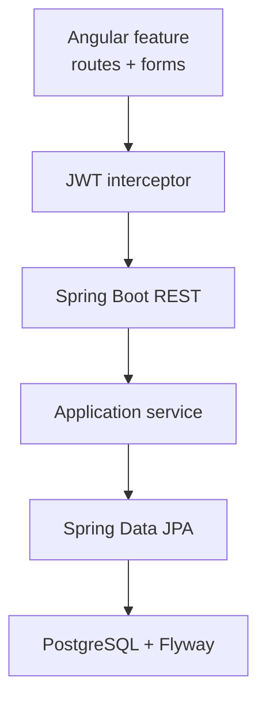

# Lab 50: Capstone Build — Angular Frontend and PostgreSQL Persistence

**Module:** 50 — Capstone Build: Angular Frontend and PostgreSQL Persistence  
**Duration:** ~45 minutes (timed path / session block with starter) · Full path: 6–8 Hours

**Primary IDE:** IntelliJ IDEA Community Edition · **Optional IDE:** VS Code / Angular Language Service

| OS | How-to for this lab |
| -- | ------------------- |
| Windows | [LAB-50-WINDOWS.md](LAB-50-WINDOWS.md) |
| macOS | [LAB-50-MACOS.md](LAB-50-MACOS.md) |

---

## Activity card

| | |
| --- | --- |
| **Time** | ~45 min session block · full path 6–8 h multi-day |
| **Checkpoint** | **E** (session-block — no separate pre-lab exercises) |
| **Must prove** | Angular feature routes · HttpClient + JWT interceptor · Flyway/schema · E2E CRUD · Selenium notes |
| **Hard gate** | Lab 48 plan · Lab 49 API slice available or stubbed |

### What you will learn

Build the Angular CRM UI and PostgreSQL persistence path for the capstone vertical slice end-to-end.

### Enterprise context

A backend-only demo without Angular routing/JWT and migration-backed PostgreSQL does not pass fullstack defense.

### Predict

Where should the JWT live—`localStorage` vs memory—and what does the interceptor attach?

### Debug

CORS or 401 on list page — interceptor missing Bearer, or API security mismatch?

---

## 45-minute timed path (session block — use starter)

> **Pacing reminder:** [PACING.md](../PACING.md) checkpoint **E**. Homework/multi-day: full CRUD, migrations, Selenium notes, `docs/frontend-persistence-demo.md`.

1. Open [`starter/README.md`](starter/README.md).
2. Copy into `java-bootcamp/examples/lab50-capstone` (or your `customer-management-platform` monorepo—see starter).
3. Fill Angular service/interceptor TODOs and confirm Flyway migration TODO for the slice.
4. Smoke: list/create against local API + PostgreSQL. Commit your work to your GitHub repo (no screenshots).
5. Mark timed-path Pass criteria. Continue remaining GUIDE steps as homework.

| Path | Time | Scope |
| ---- | ---- | ----- |
| **Timed / session block** | ~45 min | Starter TODOs + one CRUD smoke |
| **Full (multi-day)** | 6–8 Hours | Every Step in this GUIDE |

Policy: [`labs/_STARTER-PATH.md`](../../../_STARTER-PATH.md)

---

## What you'll complete (practice only)

Labs and exercises are **practice only**. Nothing is submitted or graded. Do not take screenshots. Check Pass/Fail yourself — do not write those marks anywhere. Commit your work to your private `java-bootcamp` GitHub repo.

| # | Deliverable |
| - | ----------- |
| 1 | Angular feature module/structure, routes, components |
| 2 | Services using `HttpClient` + JWT interceptor |
| 3 | PostgreSQL schema / JPA entities / repositories for the slice |
| 4 | Flyway (or approved) migrations + seed notes |
| 5 | E2E CRUD evidence for `CUS-1001` (create/read/update/delete or soft-delete as designed) |
| 6 | Selenium (or Playwright-if-approved) scenario notes |
| 7 | `docs/frontend-persistence-demo.md` |
| 8 | No secrets, real PII, or Oracle/React as taught path |

**Commit to your GitHub repo:** the items in the table above (sources + evidence + short notes).

**Do not commit:** `target/`, `node_modules/`, secrets, heap dumps, or a copied answer keys.

## Lab Overview

This Module 50 lab implements the **Angular frontend** and **PostgreSQL persistence** for the Northstar CRM capstone slice planned in Lab 48 and backed by Lab 49 APIs: feature structure, routing, services, JWT interceptor, schema/entities/repos, migrations, CRUD flows, and UI test notes.

## Learning Objectives

After completing this lab, you will be able to:

* Structure Angular features with routing and reusable components
* Call REST APIs via `HttpClient` services and a JWT interceptor
* Align DTOs with Spring Boot contracts
* Implement JPA entities/repositories and Flyway migrations on PostgreSQL
* Demonstrate E2E CRUD and document Selenium scenarios

## Business Scenario

Agents need a UI to manage interactions for Amina (`CUS-1001`) with data durable in **PostgreSQL**. Leadership freezes: **No Lab 50 pass without Angular CRUD evidence, migration-backed schema, JWT-authenticated API calls, and a demo runbook.**

| ID | Name | Notes |
| -- | ---- | ----- |
| `CUS-1001` | Amina Khan | Primary CRUD subject |
| `CUS-1002` | Ravi Singh | List/filter |
| `CUS-9999` | — | Not-found / error UI |
| `lab-request-001` | — | Correlation header from UI when supported |

---

## Architecture Context
### NOW (this lab)



## Prerequisites

Prior labs: [48](../../module-48/lab48/LAB-48-GUIDE.md) · [49](../../module-49/lab49/LAB-49-GUIDE.md).

* Node.js LTS + Angular CLI as taught in Week 4
* Java 21 + Maven; PostgreSQL reachable
* Lab 48 backlog acceptance for the UI/persistence slice
* No Oracle JDBC as the taught path

### Pre-flight

```bash
node -v
npx ng version
java -version
docker compose version
```

## Worked example (read before you code)

```typescript
// auth.interceptor.ts (sketch)
intercept(req: HttpRequest<unknown>, next: HttpHandler) {
  const token = this.auth.token;
  const authReq = token
    ? req.clone({ setHeaders: { Authorization: `Bearer ${token}` } })
    : req;
  return next.handle(authReq);
}
```

**What to notice:** Interceptor attaches Bearer; components stay free of raw header spaghetti.

---

## Implementation Steps

Prefer monorepo layout `frontend/` + `backend/` under `lab50-capstone` (or `customer-management-platform`).

---

### Step 1 — Angular feature structure and routing

**Why:** Flat `app.component` dumps fail maintainability and defense.

**Do this:** Create feature folders (e.g. `interactions`, `customers`, `auth`). Add routes: list, detail/create, login shell. Lazy-load if course pattern requires. Guard routes that need JWT.

**Expected result:** Navigable shell; unauthorized routes redirect to login.

**If it fails:** Blank router-outlet → check `RouterModule` / standalone route config.

---

### Step 2 — Services and HttpClient

**Why:** Components must not embed URLs and JSON mapping ad hoc.

**Do this:** Implement typed services for interactions/customers. Align request/response types with Lab 49 DTOs. Centralize `apiBaseUrl` via `environment.ts` (no secrets).

**Expected result:** List/create methods return Observables; errors surfaced to UI states.

**If it fails:** Wrong port/base URL → fix environment for local Boot (`8080`).

---

### Step 3 — JWT interceptor and error handling

**Why:** Manual headers on every call regress and miss refresh/logout paths.

**Do this:** Register HTTP interceptor for `Authorization`. Handle 401/403 with clear UI. Never commit real JWTs. Optional: correlation header `X-Correlation-Id: lab-request-001` for demos.

**Expected result:** Authenticated CRUD calls succeed; anon calls fail predictably.

**If it fails:** Double `Bearer Bearer` → fix token storage format.

---

### Step 4 — PostgreSQL schema, entities, repositories

**Why:** UI without durable schema is a mock.

**Do this:** Add/adjust Flyway scripts for the slice tables/constraints. Map JPA entities; keep entities out of REST JSON. Implement repositories used by Lab 49 services. Use PostgreSQL types/indexes appropriate to queries (list by customer id).

**Expected result:** `mvn` migrate on empty DB succeeds; repository tests or smoke prove rows for `CUS-1001`.

**If it fails:** Dialect/driver still Oracle → switch to PostgreSQL driver/URL per course stack.

---

### Step 5 — E2E CRUD flows

**Why:** Defense requires create → read → update → delete (or soft-delete) proof.

**Do this:** Through Angular UI (and API confirmation), exercise CRUD for an interaction on `CUS-1001`. Confirm the UI yourself (no screenshot). Document Kafka-triggered UI updates only conceptually if not yet wired.

**Expected result:** Runbook steps reproduce CRUD; DB row matches UI.

**If it fails:** UI 200 but no row → transaction/service bug; fix before Selenium.

---

### Step 6 — Selenium notes, tests, demo pack

**Why:** Manual-only UI proof does not scale to Lab 51 gates.

**Do this:** Write `docs/frontend-persistence-demo.md` with setup, fixtures, CRUD script, and Selenium scenario outlines (selectors, happy path, validation error). Add/adjust frontend unit tests and backend persistence tests as scoped. Save commit to GitHub (no screenshots).

**Expected result:** Peer can follow demo doc; Selenium notes ready for automation homework.

**If it fails:** Flaky selectors → prefer `data-testid` attributes.

---

## Implementation Checkpoints

| # | Confirm | Self-check |
| - | ------- | ---------- |
| 1 | Angular features + routing in place | Pass / Fail |
| 2 | HttpClient services + JWT interceptor | Pass / Fail |
| 3 | PostgreSQL migrations + entities/repos | Pass / Fail |
| 4 | E2E CRUD evidence for `CUS-1001` | Pass / Fail |
| 5 | Demo doc + Selenium notes | Pass / Fail |

---

## Safety Rules

* Synthetic data only; fictional emails.
* Never commit `.env` with DB passwords or JWTs.
* PostgreSQL is the taught RDBMS—not Oracle.

---

## Reference Commands

```bash
cd ~/java-bootcamp/examples/lab50-capstone/frontend
npm ci
npx ng serve
# other terminal
cd ../backend && mvn -B spring-boot:run
# evidence
curl -fsS -H "Authorization: Bearer lab-demo-token" "http://localhost:8080/api/v1/interactions?customerId=CUS-1001"
```

## Failure Experiments

| # | Experiment | Observe | Restore |
| - | ---------- | ------- | ------- |
| 1 | Remove interceptor | 401 on API | Restore provider |
| 2 | Break Flyway checksum | Boot fails migrate | Repair per policy |
| 3 | Wrong `apiBaseUrl` | Network errors in UI | Fix environment |

## Troubleshooting

| Symptom | Likely cause | Fix |
| ------- | ------------ | --- |
| CORS errors | API CORS config | Allow Angular origin |
| Empty list | Query/migration | Check Flyway + repo |
| JWT expired | Clock/token TTL | Re-login; document TTL |

## Cleanup

```bash
# stop ng serve / Boot; leave schema unless instructor says reset
git status --short
```

**Keep `lab50-capstone`**—Lab 51 builds CI/CD and OpenShift deploy on this tree.

## Reflection Questions

1. How do Angular DTOs stay aligned with Spring contracts?
2. What proves PostgreSQL persistence beyond a UI toast?
3. Which Selenium scenario catches the highest-risk regression?
