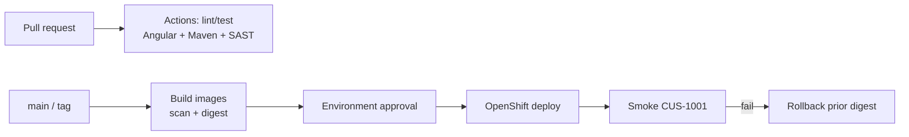

# Lab 51: Capstone Security, CI/CD and Deployment — GitHub Actions to OpenShift

**Module:** 51 — Capstone Security, CI/CD and Deployment  
**Duration:** ~45 minutes (timed path / session block with starter) · Full path: 6–8 Hours

**Primary IDE:** IntelliJ IDEA Community Edition · **Optional IDE:** VS Code / GitHub web UI

| OS | How-to for this lab |
| -- | ------------------- |
| Windows | [LAB-51-WINDOWS.md](LAB-51-WINDOWS.md) |
| macOS | [LAB-51-MACOS.md](LAB-51-MACOS.md) |

---

## Activity card

| | |
| --- | --- |
| **Time** | ~45 min session block · full path 6–8 h multi-day |
| **Checkpoint** | **E** (session-block — no separate pre-lab exercises) |
| **Must prove** | E2E Actions workflow · PR gates · Angular + Java · SAST/scan · OpenShift deploy plan · smoke/rollback |
| **Hard gate** | Lab 48 plans · Lab 50 tree buildable · GitHub repo with Actions enabled |

### What you will learn

Wire an end-to-end GitHub Actions delivery path with security gates and OpenShift deployment discipline for the capstone.

### Enterprise context

Green demos without PR gates, image scanning, environment approvals, and rollback notes are not releasable.

### Predict

Should the deploy job rebuild the Angular app and JAR, or promote digests from earlier jobs?

### Debug

OIDC to registry fails — wrong audience/subject, or secret still pasted in YAML?

---

## 45-minute timed path (session block — use starter)

> **Pacing reminder:** [PACING.md](../PACING.md) checkpoint **E**. Homework: full workflow green, approval env, smoke/rollback evidence.

1. Open [`starter/README.md`](starter/README.md).
2. Copy into `java-bootcamp/examples/lab51-capstone` (or extend your capstone monorepo).
3. Complete workflow TODOs: PR verify, Angular `npm ci`/`ng build`, Maven verify, placeholder scan, package-once notes.
4. Push a branch; capture Actions commit to GitHub (no screenshots).
5. Mark timed-path Pass criteria. Continue remaining GUIDE steps as homework.

| Path | Time | Scope |
| ---- | ---- | ----- |
| **Timed / session block** | ~45 min | Workflow TODOs + PR run evidence |
| **Full (multi-day)** | 6–8 Hours | Every Step in this GUIDE |

Policy: [`labs/_STARTER-PATH.md`](../../../_STARTER-PATH.md)

---

## What you'll complete (practice only)

Labs and exercises are **practice only**. Nothing is submitted or graded. Do not take screenshots. Check Pass/Fail yourself — do not write those marks anywhere. Commit your work to your private `java-bootcamp` GitHub repo.

| # | Deliverable |
| - | ----------- |
| 1 | `.github/workflows/` E2E workflow(s): PR gates + main/tag path |
| 2 | Angular job: `npm ci`, test (as scoped), `ng build` |
| 3 | Java verify + SAST/dependency scan evidence (or residual risk) |
| 4 | Container build + scan notes; digest identity |
| 5 | Terraform/Ansible stage notes tied to Lab 48 plan |
| 6 | OpenShift deploy job/docs with environments/approvals |
| 7 | OIDC/secrets hygiene (names only in docs) |
| 8 | Smoke + rollback runbook section |
| 9 | `docs/capstone-cicd-runbook.md` |

**Commit to your GitHub repo:** the items in the table above (sources + evidence + short notes).

**Do not commit:** `target/`, `node_modules/`, secrets, heap dumps, or a copied answer keys.

## Lab Overview

This Module 51 lab completes the capstone **security and delivery spine**: GitHub Actions end-to-end workflow, PR quality gates, Angular and Java build/test, SAST, container build/scan, Terraform/Ansible stages, OpenShift deploy with environments/approvals, OIDC/secrets, smoke tests, and rollback.

## Learning Objectives

After completing this lab, you will be able to:

* Design PR vs main vs protected-environment behaviors in Actions
* Gate fullstack changes with Angular and Maven jobs
* Integrate SAST/image scan evidence into promotion criteria
* Describe OIDC/secrets and approval gates for OpenShift
* Document smoke verification and rollback

## Business Scenario

Leadership freezes: **No production-like OpenShift promote without Actions evidence, digest pinning, environment approval, smoke, and a written rollback.** You own that gate for Northstar CRM built in Labs 49–50.

| ID | Name | Notes |
| -- | ---- | ----- |
| `CUS-1001` | Amina Khan | Post-deploy smoke |
| `lab-request-001` | — | Correlation on smoke calls |
| `lab51-capstone` | — | Repo / folder name |

---

## Architecture Context
### NOW (this lab)



## Prerequisites

Prior labs: [48](../../module-48/lab48/LAB-48-GUIDE.md) · [49](../../module-49/lab49/LAB-49-GUIDE.md) · [50](../../module-50/lab50/LAB-50-GUIDE.md) · [43](../../../Week%205%20-%20DevOps,%20CI-CD%20and%20OpenShift/module-43/lab43/LAB-43-GUIDE.md).

* GitHub repository with Actions enabled
* Lab 48 CI/CD + env strategy docs
* Buildable Angular + Spring Boot tree
* OpenShift Project access or documented deploy substitute

### Pre-flight

```bash
gh auth status   # or GitHub UI
node -v && java -version
```

## Worked example (read before you code)

```yaml
frontend:
  runs-on: ubuntu-latest
  defaults:
    run:
      working-directory: frontend
  steps:
    - uses: actions/checkout@v4
    - uses: actions/setup-node@v4
      with: { node-version: "20", cache: npm, cache-dependency-path: frontend/package-lock.json }
    - run: npm ci
    - run: npx ng build --configuration=production
    # Add headless unit tests when the Angular tree has specs (Lab 50 starter skips Karma).
```

**What to notice:** Fullstack CI includes Angular—not Maven alone (see Lab 43 note).

---

## Implementation Steps

Project root: `~/java-bootcamp/examples/lab51-capstone` (or your capstone monorepo).

---

### Step 1 — E2E workflow skeleton and PR gates

**Why:** Untyped “one job does everything” pipelines hide failures and skip Angular.

**Do this:** Create `.github/workflows/capstone-ci.yml` with `pull_request` and `push` to `main`. Separate jobs: `frontend`, `backend`, optional `scan`. Require jobs as branch protection checks when instructor allows.

**Expected result:** PR run shows Angular + Maven jobs; failure blocks merge story.

**If it fails:** Wrong `working-directory` → fix paths to `frontend/` / `backend/`.

---

### Step 2 — Angular build/test job

**Why:** Capstone UI regressions must fail CI before OpenShift.

**Do this:** Implement `npm ci` and `npx ng build` (production config). Add headless unit tests when the tree has specs (Lab 50 starter skips Karma). Upload `dist/` artifact on `main` if deploy consumes it (or bake into nginx image in the container job).

**Expected result:** Artifact or image layer includes Angular build output.

**If it fails:** Lockfile missing → commit `package-lock.json`.

---

### Step 3 — SAST, container build, and scan

**Why:** Unscanned images fail enterprise promote.

**Do this:** Add SAST/dependency scan (tool per instructor). Build CRM API image (and frontend image if split). Record digest. Do not embed secrets in Dockerfile. Document scan gate threshold in runbook.

**Expected result:** Digest + scan report (or residual risk) attached to evidence pack.

**If it fails:** Scan always skipped → document explicit risk owner/date.

---

### Step 4 — Terraform/Ansible stages and OpenShift deploy

**Why:** Click-ops deploys cannot be audited.

**Do this:** Add workflow stages or linked docs that run `terraform plan` (apply only with approval) and Ansible syntax/check as scoped in Lab 48. Deploy to OpenShift using digest, Project from Lab 42 patterns, and GitHub **Environments** with required reviewers for stage/prod-like targets.

**Expected result:** Deploy job consumes prior artifacts/digests—does not rebuild silently.

**If it fails:** `mvn package` inside deploy → remove; promote artifacts only.

---

### Step 5 — OIDC / secrets hygiene

**Why:** Long-lived PAT in YAML is an incident.

**Do this:** Prefer OIDC to cloud/registry where taught; otherwise GitHub Environment secrets. Document **names only** in `docs/capstone-cicd-runbook.md`. Ensure workflows never `echo` secrets.

**Expected result:** Secrets absent from Git history.

**If it fails:** Secret in log → rotate and scrub per instructor.

---

### Step 6 — Smoke, rollback, and evidence pack

**Why:** Deploy without verify leaves Route green and app wrong.

**Do this:** Post-deploy smoke: readiness + `CUS-1001` path through Route. Document rollback to previous digest/`oc rollout undo`. Complete Failure Experiments. Commit your work to your GitHub repo. Do not take screenshots.

**Expected result:** Peer can rerun CI and describe rollback without Slack.

**If it fails:** Smoke uses laptop `localhost` only → add Route-based steps.

---

## Implementation Checkpoints

| # | Confirm | Self-check |
| - | ------- | ---------- |
| 1 | PR gates include Angular + Maven | Pass / Fail |
| 2 | SAST/scan + image digest evidence | Pass / Fail |
| 3 | OpenShift deploy uses approvals / env secrets | Pass / Fail |
| 4 | Smoke + rollback documented | Pass / Fail |
| 5 | No secrets in YAML | Pass / Fail |

---

## Safety Rules

* Authorized OpenShift Projects only.
* Never commit cluster credentials, registry passwords, or cloud keys.
* Package-once / digest promote—no silent rebuilds on deploy.
* Synthetic smoke data only.

---

## Reference Commands

```bash
cd ~/java-bootcamp/examples/lab51-capstone
gh workflow list
gh run list --limit 5
# local mirrors (need Lab 50 frontend/ + backend/)
cd frontend && npm ci && npx ng build --configuration=production
cd ../backend && mvn -B -ntp clean verify
```

## Failure Experiments

| # | Experiment | Observe | Restore |
| - | ---------- | ------- | ------- |
| 1 | Break Angular unit test | frontend job red | Fix test |
| 2 | Deploy rebuilds JAR | Immutability fail | Consume artifact |
| 3 | Skip environment approval | Policy fail | Require reviewers |

## Troubleshooting

| Symptom | Likely cause | Fix |
| ------- | ------------ | --- |
| npm ci fails | Lockfile / Node version | Pin Node 20; commit lock |
| ImagePullBackOff on OS | Wrong digest/secret | Fix pull secret + tag |
| OIDC claim errors | Trust policy | Align sub/aud with IdP docs |

## Cleanup

```bash
git status --short
# leave Environments configured; revoke personal tokens if any
```

**Keep `lab51-capstone`**—Lab 52 defense uses this runbook and Actions evidence.

## Reflection Questions

1. What evidence proves Angular was gated before deploy?
2. How do approvals reduce blast radius?
3. What is your rollback unit—tag, digest, or commit?
