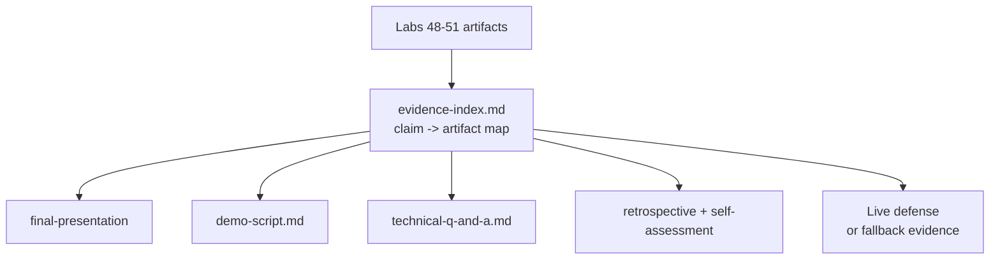

# Lab 52: Capstone Final Defense — Northstar CRM Presentation and Technical Defense

**Module:** 52 — Capstone Final Defense  
**Duration:** ~45 minutes (timed path / session block with starter) · Full path: 5–6 Hours

**Primary IDE:** IntelliJ IDEA Community Edition · **Optional IDE:** VS Code

| OS | How-to for this lab |
| -- | ------------------- |
| Windows | [LAB-52-WINDOWS.md](LAB-52-WINDOWS.md) |
| macOS | [LAB-52-MACOS.md](LAB-52-MACOS.md) |

---

## Activity card

| | |
| --- | --- |
| **Time** | ~45 min session block · full path 5–6 h multi-day |
| **Checkpoint** | **E** (after Ex 1→2→3→4→5→6) |
| **Must prove** | Slide outline · timed demo script · ≥5 evidence links · deny/fallback beat |
| **Hard gate** | Pre-lab Pass · Labs 48–51 evidence available (gaps labeled) |

### What you will learn

Deliver an evidence-backed CRM defense: narrative, timed demo, Q&A, blameless retro, completion self-check.

### Enterprise context

A lucky happy-path click-through without an evidence index fails professional defense standards.

### Predict

Panel disputes a security claim — what do you open first?

### Debug

Token visible on a projected screenshot — immediate actions?

---

## 45-minute timed path (session block — use starter)

> **Pacing reminder:** [PACING.md](../PACING.md) checkpoint **E**. Homework/multi-day: PDF export, full Q&A, retrospective, self-assessment, panel delivery.

In class, use the starter slide outline + demo script so the **session block** fits **~45 minutes**. Full panel delivery, PDF export, retrospective, and self-assessment remain **multi-day** on the full path.

1. Open [`starter/README.md`](starter/README.md).
2. Copy `starter/` into `java-bootcamp/examples/lab52-capstone/` (see starter README). Capstone teams may copy `defense/` into an existing Lab 50/51 monorepo instead.
3. Fill slide outline, timed demo script, and evidence-index stubs — fixtures `CUS-1001` / `lab-request-001`.
4. Rehearse once (smoke). Commit your work to your GitHub repo (no screenshots).
5. Check timed-path Pass criteria in the starter README yourself (do not write the marks down). Continue remaining GUIDE steps as homework / multi-day work.

| Path | Time | Scope |
| ---- | ---- | ----- |
| **Timed / session block** | ~45 min | Starter TODOs + rehearsal smoke |
| **Full (multi-day)** | 5–6 Hours | Every Step in this GUIDE |

Policy: [`labs/_STARTER-PATH.md`](../../../_STARTER-PATH.md)

---

## What you'll complete (practice only)

Labs and exercises are **practice only**. Nothing is submitted or graded. Do not take screenshots. Check Pass/Fail yourself — do not write those marks anywhere. Commit your work to your private `java-bootcamp` GitHub repo.

Keep this checklist visible while you work.

| # | Deliverable |
| - | ----------- |
| 1 | `defense/final-presentation.pdf` (or instructor-approved slide export) |
| 2 | `defense/demo-script.md` |
| 3 | `defense/evidence-index.md` |
| 4 | `defense/technical-q-and-a.md` |
| 5 | `defense/retrospective.md` |
| 6 | `defense/self-assessment.md` |
| 7 | Baseline/demo validation notes (health, smoke, or fallback) |
| 8 | One controlled failure-path demo beat result |

**Commit to your GitHub repo:** the items in the table above (sources + evidence + short notes).

**Do not commit:** `target/`, `node_modules/`, secrets, heap dumps, or a copied answer keys.

## Lab Overview

This Module 52 lab is the Week 6 **final defense**: rehearse and deliver a business-to-technology narrative, a deterministic live demo, evidence-backed technical Q&A, a blameless retrospective, and a evidence-backed completion self-check—packaged for the review panel and portfolio.

## Learning Objectives

After completing this lab, you will be able to:

* Build a business-to-technology narrative for the CRM
* Run a deterministic timed live demo with roles
* Explain decisions and trade-offs with ADR citations
* Answer technical questions with evidence links
* Conduct a blameless retrospective with measurable actions

## Business Scenario

A review panel will assess the Enterprise CRM delivery. Leadership freezes:

**No claim on the slide deck is allowed unless `evidence-index.md` points to a reproducible artifact (test log, digest, SQL excerpt, ADR, scan report, or demo command).**

You own the defense quality bar using the same fixtures as Labs 48–51.

Use these fixtures consistently:

| ID | Name | Notes |
| -- | ---- | ----- |
| `CUS-1001` | Amina Khan | primary live demo customer |
| `CUS-1002` | Ravi Singh | secondary search/status beat |
| `CUS-9999` | — | optional not-found beat |
| `lab-request-001` | — | correlation shown in logs/events |
| `final-defense-001` | — | alternate correlation if lab-request already used |

**Security note for evidence.** Portfolio packs must be scrubbed: no JWTs, connection strings, cluster credentials, or real emails. Prefer `example.test` domains.

---

## Architecture Context
### NOW (this lab)



## Prerequisites

Prior labs: [48](../../module-48/lab48/LAB-48-GUIDE.md) · [51](../../module-51/lab51/LAB-51-GUIDE.md).

Confirm (Lab 0 tools assumed):

* Evidence packs from Labs 48–51 accessible
* Demo environment reachable (UI/API/DB/Kafka or documented fallback)
* Presentation tooling available
* No secrets committed to Git

### Pre-flight

```bash
java -version
mvn -version
```

## Worked example (read before you code)

Study this pattern once before Step 1. Your job is to apply the same idea in the Steps — do not skip ahead to a full solution.

```bash
curl -fsS -H "Authorization: Bearer lab-demo-token" \
  "http://localhost:8080/api/v1/interactions?customerId=CUS-1001"
curl -i -X POST "http://localhost:8080/api/v1/interactions" \
  -H "Authorization: Bearer lab-demo-token" -H 'Content-Type: application/json' \
  -H 'X-Correlation-ID: lab-request-001' \
  -d '{"customerId":"CUS-1001","interactionType":"NOTE","summary":"Resolved login question"}'
oc get pods -l app=crm-api
oc rollout history deployment/crm-api
```

**What to notice:** Match names, IDs, and failure behavior from the scenario — instructors check these.

---

## Implementation Steps

Parts 1–8 map to Steps 1–8; Step 9 closes archival evidence.

---

### Step 1 — Inventory evidence (Part 1)

**Why:** Unindexed claims collapse under the first hard question.

**Do this:** Fill the starter stub `defense/evidence-index.md` mapping requirements → features → tests → scans → pipeline → digest → deployment → monitoring. Every slide claim gets a link/path. State known limitations honestly.

Minimum rows:

| Claim | Artifact |
| ----- | -------- |
| C4 architecture | `docs/architecture/*.md` |
| CAP-12 acceptance | `docs/backlog.md` |
| Interaction API | Lab 49 tests + `backend-demo.md` |
| UI→PostgreSQL | Lab 50 SQL |
| JWT deny | Lab 51 auth tests + smoke |
| Rollback | Lab 51 rollback notes |
| NFRs measurable | `docs/nfrs.md` |
| Risk register owners | `docs/risk-register.md` |
| Correlation discipline | demos using `lab-request-001` |

Also list explicit non-claims (what you will not pretend to have proven in the panel).

**Expected result:** No orphan claims; limitations listed with owners; non-claims explicit.

**If it fails:** Missing Lab 51 digest → gather from registry/pipeline before slides. Orphan marketing slide → delete or add evidence.

---

### Step 2 — Design presentation story (Part 2)

**Why:** Tool tours without user outcomes lose business stakeholders.

**Do this:** Draft slide outline:

1. Users, problem, success measure
2. Architecture driven by quality needs (NFR/ADR)
3. Vertical slice demo preview
4. Security and delivery gates
5. Outcomes, limitations, next steps

Export `defense/final-presentation.pdf` (or approved format). Keep fixtures `CUS-1001`/`CUS-1002` on demo slides.

**Expected result:** 8–15 slides; story fits instructor timebox; every technical slide points to evidence-index IDs.

**If it fails:** Slide spam of screenshots only → add narrative connective tissue.

---

### Step 3 — Write demo script (Part 3)

**Why:** Unscripted demos overrun and skip failure paths.

**Do this:** Author `defense/demo-script.md` with prepared synthetic data, speaker vs operator roles, timed transitions, commands, expected output, and one failure path.

```markdown
| Time | Speaker action | Operator action | Evidence |
|---|---|---|---|
| 0:00 | State user problem | Show title | Product brief |
| 1:00 | Explain architecture | Show diagram | ADR links |
| 3:00 | Narrate agent journey | Sign in and search CUS-1001 | Auth and API logs |
| 5:00 | Explain persistence | Record interaction | PostgreSQL row |
| 7:00 | Explain events | Show Kafka event | Correlation lab-request-001 |
| 9:00 | Show resilience | Submit invalid input | Problem Details |
| 10:00 | Show delivery | Open pipeline and digest | Reports |
| 11:00 | Summarize outcomes | Show metrics / rollback note | NFR evidence |
```

Pre-seed checklist before the panel enters:

_Check **Pass** or **Fail** yourself. Do not write these marks anywhere — nothing is submitted or graded. Commit your work to your GitHub repo._

| # | Confirm | Self-check |
| - | ------- | ---------- |
| 1 | Amina (`CUS-1001`) searchable | Pass / Fail |
| 2 | Ravi (`CUS-1002`) searchable | Pass / Fail |
| 3 | Demo token valid for agent role | Pass / Fail |
| 4 | Kafka console or UI lag view bookmarked | Pass / Fail |
| 5 | SQL client ready with sanitized query | Pass / Fail |
| 6 | Fallback screenshots folder open | Pass / Fail |

**Expected result:** Timed script ≤ allowed demo window; failure beat included; pre-seed checklist complete.

**If it fails:** No operator role → assign one; dead air during waits is a rehearsal bug. Script assumes unseeded DB → run seed job before panel.

---

### Step 4 — Prepare demo recovery (Part 4)

**Why:** Live infra fails; professionals fail over transparently.

**Do this:** Keep backup screenshots/video and API commands. Know restart/rollback. Practice switching to evidence without apologizing endlessly.

```bash
curl -fsS -H "Authorization: Bearer lab-demo-token" \
  "http://localhost:8080/api/v1/interactions?customerId=CUS-1001"
curl -i -X POST "http://localhost:8080/api/v1/interactions" \
  -H "Authorization: Bearer lab-demo-token" -H 'Content-Type: application/json' \
  -H 'X-Correlation-ID: lab-request-001' \
  -d '{"customerId":"CUS-1001","interactionType":"NOTE","summary":"Resolved login question"}'
oc get pods -l app=crm-api
oc rollout history deployment/crm-api
```

Failover script language (practice aloud):

> “The live cluster is unhealthy. We are switching to recorded evidence from Lab 51 smoke run `<id>` and Lab 50 SQL proof for `CUS-1001`. Here is what that evidence does and does not prove.”

**Expected result:** Fallback pack in `defense/notes/`; criteria for when to switch documented; spoken failover line rehearsed.

**If it fails:** Fallback contains secrets → scrub before archiving. Team argues instead of switching → designate a single failover caller.

---

### Step 5 — Rehearse technical defense (Part 5)

**Why:** Architecture memorization without evidence structure fails Q&A.

**Do this:** Fill the starter stub `defense/technical-q-and-a.md` with practice answers using **claim → evidence → trade-off → next-step**. Cover security, consistency, Kafka, PostgreSQL, testing, CI/CD, probes, monitoring. Practice saying “unknown—here is how we would verify.”

Sample topics:

* Where is JWT validated?
* What happens if Kafka is down at publish time (per ADR)?
* How do you prove UI wrote PostgreSQL?
* What is your rollback unit (digest)?
* Which NFR is not yet met?
* How do you prevent duplicate interaction side effects?
* What does `lab-request-001` prove in logs versus what it does not prove?
* Why is the Angular client not the security boundary?

Card template:

```markdown
### Q: ...
- Claim:
- Evidence (path/id):
- Trade-off:
- Next step / residual risk:
- Practice time (seconds):
```

**Expected result:** ≥10 Q&A cards; dry-run with peer timed to 60–90s each.

**If it fails:** Answers without artifact paths → update evidence-index first. Answers longer than two minutes → cut to the four-part structure.

---

### Step 6 — Deliver and capture feedback (Part 6)

**Why:** Uncaptured panel questions become lost commitments.

**Do this:** Respect presentation and demo timeboxes. Narrate outcomes while operating. Record questions and follow-ups in the optional stub `defense/feedback-log.md` with owners/dates.

**Expected result:** Completed delivery (or instructor-scheduled slot) with feedback log.

**If it fails:** Overrun killing Q&A → cut optional slides; keep failure-path beat.

---

### Step 7 — Run retrospective (Part 7)

**Why:** Blame narratives block learning and violate professional practice.

**Do this:** Build delivery timeline for Week 6. Discuss helpful/harmful system conditions without blaming individuals. Choose a small number of owned measurable improvements.

```markdown
## Observation

Frontend and backend contracts diverged.
## Impact

Two stories missed staging rehearsal.
## Contributing conditions

Examples were copied manually and no consumer test ran in CI.
## Action

Add OpenAPI contract validation to pull requests.
## Owner and due date

Backend lead — within two weeks.
## Success measure

Three releases with no staging contract mismatch.
```

**Expected result:** Filled stub `defense/retrospective.md` with ≤5 actions, each owned.

**If it fails:** More than five vague actions → cut to measurable few.

---

### Step 8 — Score and close (Part 8)

**Why:** Ungrounded self-scores and unclean archives create portfolio risk.

**Do this:** Fill the starter stub `defense/self-assessment.md` with evidence links showing each required outcome is complete. Archive secret-free portfolio summary.

Scrub checklist before archive:

_Check **Pass** or **Fail** yourself. Do not write these marks anywhere — nothing is submitted or graded. Commit your work to your GitHub repo._

| # | Confirm | Self-check |
| - | ------- | ---------- |
| 1 | No JWTs or refresh tokens in screenshots | Pass / Fail |
| 2 | No connection strings or cluster credentials | Pass / Fail |
| 3 | No real customer emails/names (use Amina/Ravi fixtures only) | Pass / Fail |
| 4 | No `.env` copies in `defense/` | Pass / Fail |
| 5 | Evidence paths resolve from repo root | Pass / Fail |

**Expected result:** Self-score table filled; archive scrubbed (`git status` clean of secrets).

**If it fails:** Score without links → add evidence-index references. Secret found in pack → redact, rotate if needed, regenerate screenshots.

---

### Step 9 — Failure experiments + evidence pack

**Why:** Defense quality includes graceful degradation of the demo itself.

**Do this:** Complete Failure Experiments. Rehearse one intentional failure beat. Confirm all six defense deliverables present. Peer reviews `evidence-index.md` for claim orphans.

**Expected result:** ≥3 experiments; six artifacts complete; peer sign-off noted.

**If it fails:** See Troubleshooting.

---

## Implementation Checkpoints

### Checkpoint A — Evidence and story

_Check **Pass** or **Fail** yourself. Do not write these marks anywhere — nothing is submitted or graded. Commit your work to your GitHub repo._

| # | Confirm | Self-check |
| - | ------- | ---------- |
| 1 | `evidence-index.md` maps claims → artifacts | Pass / Fail |
| 2 | Presentation tells user→architecture→gates→outcomes | Pass / Fail |
| 3 | Limitations listed honestly | Pass / Fail |

### Checkpoint B — Demo readiness

_Check **Pass** or **Fail** yourself. Do not write these marks anywhere — nothing is submitted or graded. Commit your work to your GitHub repo._

| # | Confirm | Self-check |
| - | ------- | ---------- |
| 1 | Timed `demo-script.md` with speaker/operator | Pass / Fail |
| 2 | Fixtures `CUS-1001` / `CUS-1002` / `lab-request-001` | Pass / Fail |
| 3 | Fallback screenshots/API/rollback ready | Pass / Fail |

### Checkpoint C — Defense quality

_Check **Pass** or **Fail** yourself. Do not write these marks anywhere — nothing is submitted or graded. Commit your work to your GitHub repo._

| # | Confirm | Self-check |
| - | ------- | ---------- |
| 1 | Q&A cards with claim/evidence/trade-off/next | Pass / Fail |
| 2 | Delivery + `feedback-log.md` | Pass / Fail |
| 3 | Blameless retro with owned actions | Pass / Fail |

### Checkpoint D — Close-out hygiene

_Check **Pass** or **Fail** yourself. Do not write these marks anywhere — nothing is submitted or graded. Commit your work to your GitHub repo._

| # | Confirm | Self-check |
| - | ------- | ---------- |
| 1 | Self-assessment with evidence links | Pass / Fail |
| 2 | Portfolio archive scrubbed of secrets | Pass / Fail |
| 3 | Peer review of defense pack complete | Pass / Fail |

---

## Reference Commands, Configuration, and Code

### Demo API fallback

```bash
curl -fsS -H "Authorization: Bearer lab-demo-token" \
  "http://localhost:8080/api/v1/interactions?customerId=CUS-1001"
```

### Commands

```bash
cd ~/java-bootcamp/examples/lab52-capstone
ls defense
git status --short
```

## Failure Experiments

| # | Experiment | Observe | Restore |
| - | ---------- | ------- | ------- |
| 1 | Remove evidence link for one slide claim | Peer flags orphan | Restore link |
| 2 | Kill API mid-rehearsal | Team switches to fallback | Restart or continue with evidence |
| 3 | Ask “where is auth enforced?” cold | Weak answer | Rehearse card + SecurityConfig path |
| 4 | Overrun demo by 3 minutes | Q&A compressed | Cut slides; keep failure beat |
| 5 | Include a JWT in screenshot | Secret risk | Redact; regenerate evidence |
| 6 | Improvised new customer mid-demo | Fixture drift / fail | Stay on CUS-1001/1002 |
| 7 | Blame-laced retro draft | Learning blocked | Rewrite as system conditions |

---

## Troubleshooting

| Symptom | Likely cause | Fix |
| ------- | ------------ | --- |
| Demo data missing | Seeds not applied | Re-run Lab 50 seed; use curl fallback |
| Panel disputes claim | No evidence row | Add artifact or retract claim |
| Nervous silence | No script roles | Assign speaker/operator |
| Blame in retro | Facilitation slip | Reframe to system conditions |
| Huge slide deck | Scope creep | Timebox; move detail to appendix |
| Token on projector | Bad screenshot | Scrub and rotate training token |
| “Works on my machine” | Env drift | Use same URL/digest as Lab 51 |
| Incomplete Labs 48–51 | Skipped gates | Finish evidence before defense |

## Security and Production Review

Optional — jot brief notes in your README if useful for your progress check (not a separate essay):

1. Which inputs remain untrusted in the demonstrated system?
2. Where did you prove authn/authz/validation?
3. Which sensitive values were excluded from the portfolio pack?

---


## Cleanup

```bash
cd ~/java-bootcamp/examples/lab52-capstone
# stop demo servers if local
git status --short
# scrub defense/notes of any accidental tokens before archive
```

Keep sanitized defense pack; delete temporary credential files.

**Keep `defense/`**—it is the primary portfolio and assessment packet for Week 6.

Capstone progress checks should weigh evidence linked from `defense/evidence-index.md` over unrehearsed claims.


## Reflection Questions

Write **1–3 sentence** answers (not essays):

1. Which design decision most affected the defense narrative?
2. What evidence most strongly proves the CRM works?
3. Which panel (or rehearsal) question was hardest?

---


